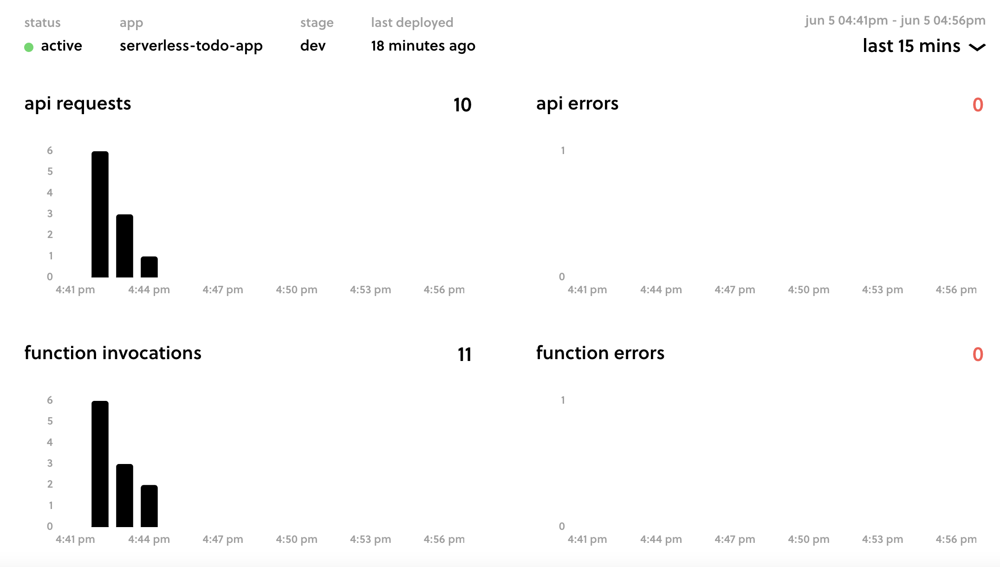
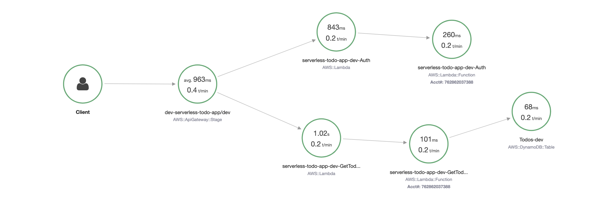
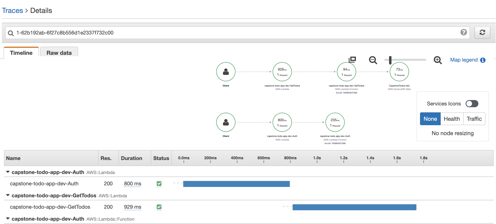

# Serverless

# Auth0

# Cloudformation

# XRAY

# endpoints

+ GET - https://sfnpf7zea3.execute-api.us-east-1.amazonaws.com/dev/todos
+ POST - https://sfnpf7zea3.execute-api.us-east-1.amazonaws.com/dev/todos
+ PATCH - https://sfnpf7zea3.execute-api.us-east-1.amazonaws.com/dev/todos/{todoId}
+ DELETE - https://sfnpf7zea3.execute-api.us-east-1.amazonaws.com/dev/todos/{todoId}
+ POST - https://sfnpf7zea3.execute-api.us-east-1.amazonaws.com/dev/todos/{todoId}/attachment

# functions

+ Auth: serverless-todo-app-dev-Auth
+ GetTodos: serverless-todo-app-dev-GetTodos 
+ CreateTodo: serverless-todo-app-dev-CreateTodo 
+ UpdateTodo: serverless-todo-app-dev-UpdateTodo
+ DeleteTodo: serverless-todo-app-dev-DeleteTodo 
+ GenerateUploadUrl: serverless-todo-app-dev-GenerateUploadUrl