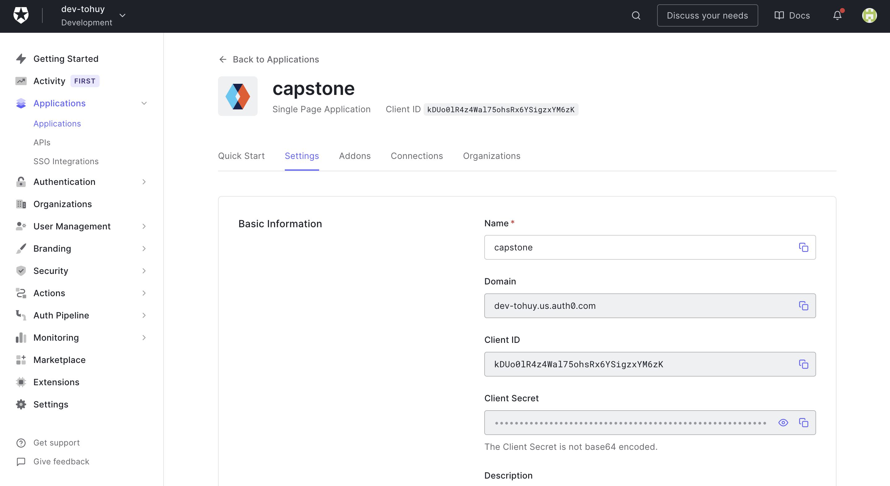

# Information
My project base on project 4: serverless
One simple app get and update information for your trip plan

# To run local: 
at Client: 
npm i
npm run start
http://localhost:3000/

# Test
I use Postman to test
Please use postman collection to test API end point
Thank you

NOTE:
+ how to get Bearer {{authToken}}:
    after run local and login success: get it at 
    

+ API get api weather: this is free api and limit get (about 50 times), if > 50 will error and tomorrow will reset  

# Serverless

# Auth0

# Cloudformation

# XRAY

# endpoints
+ GET - https://qbw9339npb.execute-api.us-east-1.amazonaws.com/dev/todos
+ POST - https://qbw9339npb.execute-api.us-east-1.amazonaws.com/dev/todos
+ PATCH - https://qbw9339npb.execute-api.us-east-1.amazonaws.com/dev/todos/{todoId}
+ DELETE - https://qbw9339npb.execute-api.us-east-1.amazonaws.com/dev/todos/{todoId}
+ POST - https://qbw9339npb.execute-api.us-east-1.amazonaws.com/dev/todos/{todoId}/attachment

# functions
+ Auth: capstone-todo-app-dev-Auth 
+ GetTodos: capstone-todo-app-dev-GetTodos 
+ CreateTodo: capstone-todo-app-dev-CreateTodo 
+ UpdateTodo: capstone-todo-app-dev-UpdateTodo 
+ DeleteTodo: capstone-todo-app-dev-DeleteTodo 
+ GenerateUploadUrl: capstone-todo-app-dev-GenerateUploadUrl 